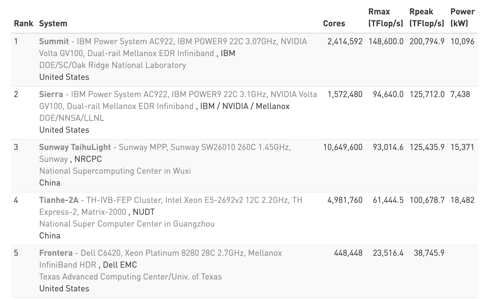
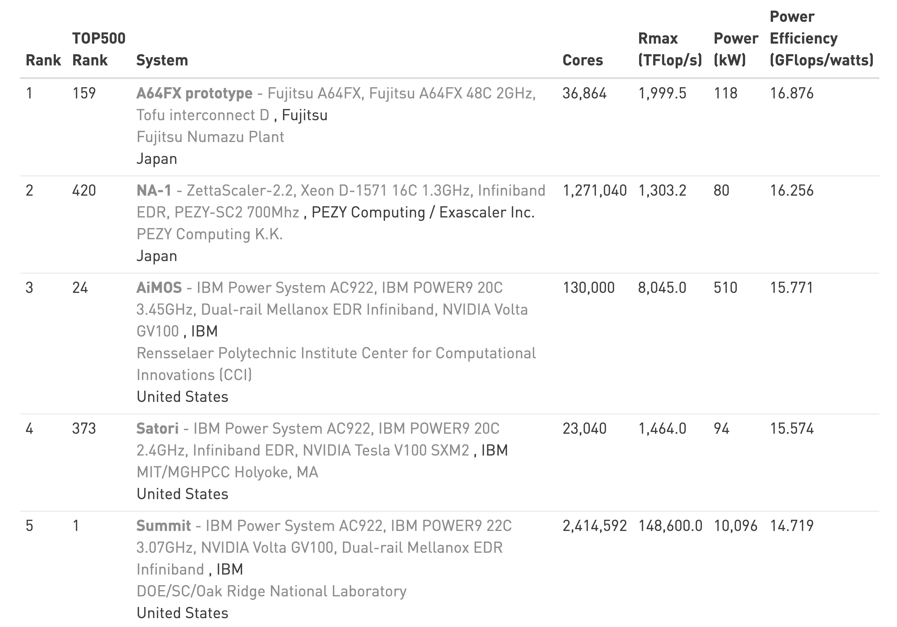
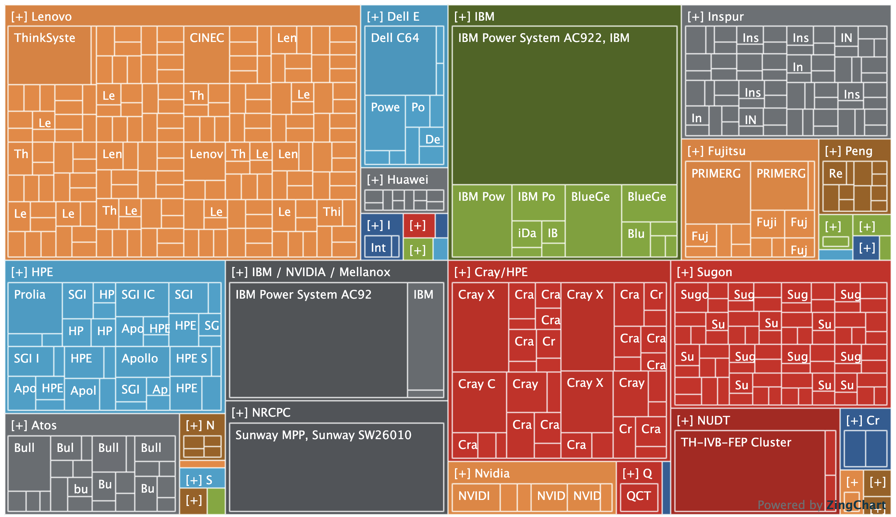

class: center, middle

# CME 213, ME 339 - Winter 2020</br>Introduction to parallel computing using MPI, openMP, and CUDA

## Eric Darve, ICME, Stanford


"Computers are useless.  They can only give you answers."
(Pablo Picasso)

---
class: middle

# Homework 1

Pre-requisite homework

Topics: 

- derived classes
- polymorphism
- standard library
- testing

---
class: middle

# Submission

1. Copy your files to cardinal
2. Run a Python script with code

Grading is done on gradescope

.center[]

---
class: center, middle

Deadline is **Friday January 17**

---
class: center, middle

# Why parallel computing?

---
class: center, middle

Parallel computing is omni-present

Any type of non-trivial computing requires parallel computing

---

.two-column[]
.two-column[- Gordon Moore 1965: "the number of transistors on a chip shall double every 18–24 months."
- Accompanied by an increase in clock speed
]

---
class: center, middle

# Intel microprocessor trends


---

# But

Increase in transistor density is limited by:
- Leakage current increases
- Power consumption increases
- Heat generated increases

---
class: center, middle

Memory access time has not been reduced at a rate comparable to the processing speed

Go parallel!

Multiple cores on a processor

---
class: center, middle

# Multicore

.two-column[]
.two-column[One/few 

but 

fast core(s)
]

---
class: center, middle

# Manycore

.two-column[]
.two-column[ .left[- Many, but slower cores
- GPUs]
]

---
class: center, middle

# Core increase; frequency plateau

.two-column[
Historical data on 1403 Intel microprocessors]

.two-column[
Historical data on 566 NVIDIA GPUs]

---
class: center, middle

# Memory wall; bandwidth and latency

.two-column[
Intel microprocessors]

.two-column[
NVIDIA GPUs]

---
class: center, middle

More info at

.smaller[https://pure.tue.nl/ws/portalfiles/portal/3942529/771987.pdf]

---
class: center, middle

# Parallel computing everywhere!

.two-column[]
.two-column[]

---
class: center, middle

# Multi and many core processors

.two-column[

Intel Ice Lake 10 nm]
.two-column[
NVIDIA Turing TU102 architecture]

<!-- https://en.wikipedia.org/wiki/List_of_Nvidia_graphics_processing_units -->

---
class: center, middle


---
class: middle

.two-column[]
.two-column[</br></br>]

---
class: center, middle


---
class: center, middle

# Top 500 Supercomputers

---
class: center, middle



---
class: center, middle

Green 500</br>



---
class: center, middle

Vendor shares</br>


---
class: center, middle


---
class: center, middle

More at

https://www.top500.org/

---
class: center, middle

# Example of a Parallel Computation

---
class: center, middle

# Parallel programs often look very different sequential programs

---
class: center, middle

.two-column[</br>Sequential]

.two-column[</br>Parallel]

---
class: middle

# Example: program to sum numbers

```
for (int i = 0; i < n; ++i)
{
    x = ComputeNextValue();
    sum += x;
}
```

---
class: center, middle

We have $p$ cores that can compute and exchange data

---
class: center, middle

Can we accelerate our calculation by splitting the work among the cores?

---
class: middle

```
int r; /* thread number */
int b; /* number of entries processed */
int my_first_i = r * b;
int my_last_i = (r + 1) * b;
for (int my_i = my_first_i; my_i < my_last_i; 
     my_i++)
{
    my_x = ComputeNextValue();
    my_sum += my_x;
}
```

---
class: center, middle

Not that simple

Each core has computed a partial sum

All these partial sums need to summed up together

---
class: center, middle

Simplest approach: 

have one "master" thread do all the work

---
class: middle

```
if (r == 0) /* master thread */
{
    int sum = my_sum;
    for (int ro = 1; ro < p; ++ro)
    {
        int sum_ro;
        ReceiveFrom(&sum_ro, ro);
        sum += sum_ro;
    }
}
else /* worker thread */
{
    SendTo(&my_sum, 0);
}
```

---
class: center, middle

That may not be enough

If we have many cores, this final sum may take a lot of time


---
class: center, middle


---
class: center, middle

This simple example illustrates the fact that it is difficult for a compiler to parallelize a program.

Instead the programmer must often re-write his code having in mind that multiple cores will be computing in parallel.

---
class: center, middle

The purpose of this class is to teach you the most common parallel languages used in science and engineering.

---
class: center, middle

# Shared Memory Processor

---
class: middle

# Schematic

- A number of processors or cores
- A shared physical memory (global memory)
- An interconnection network to connect the processors with the memory

---
class: center, middle


---
class: center, middle

# Shared memory NUMA

In many cases, the program views the memory as a single addressable space.

In reality, the memory is physically distributed.

---
class: center, middle

NUMA: non-uniform memory access

Faster access to memory

But special hardware required to move data between memory banks

---
class: center, middle


---
class: center, middle

# Bulldozer server (AMD)

</br>
.smaller[ccNUMA uses inter-processor communication between cache controllers to keep a consistent memory image when more than one cache stores the same memory location]

<!-- hwloc's lstopo tool -->

<!-- https://en.wikipedia.org/wiki/Non-uniform_memory_access -->

---
class: center, middle

# Motherboard with 2 CPU sockets


---
class: center, middle

# Performance tip on multicore

memory is key to developing high-performance multicore applications

memory is hierarchical and complex


---
class: center, middle


---
class: center, middle


---
class: center, middle

# Process

Process: program in execution

Comprises: the executable program along with all information that is necessary for the execution of the program.

---
class: center, middle

# Thread

Thread: an extension of the process model. Can be viewed as a "lightweight" process.

A thread may be described as a "procedure" that runs independently from the main program.

---
class: center, middle

In this model, each process may consist of multiple independent control flows that are called **threads.**

---
class: center, middle

Imagine a program that contains a number of procedures. 

Then imagine these procedures being able to be scheduled to run simultaneously and/or independently by the operating system. 

This describes a **multi-threaded program.**

---
class: center, middle

# Shared address space

All the threads of one process share the address space of the process, i.e., they have a common address space.

When a thread stores a value in the shared address space, another thread of the same process can access this value.

---
class: center, middle


---
class: center, middle

# Threads

---
class: middle

# Threads are everywhere

- C++ threads (11): `std::thread`
- "C" threads: `Pthreads`
- Java threads: `Thread thread = new Thread();`
- Python threads:</br>`t = threading.Thread(target=worker)`
- Cilk: `x = spawn fib (n-1);`
- Julia: `r = remotecall(rand, 2, 2, 2)`
- OpenMP

---
class: center, middle

# C++ threads exercise

Open the file `cpp_thread.cpp`

Type `make` to compile

---
```
#include <thread>
void f1() {
    cout << "f1() called\n";
}
...
void f4() { /* todo */ }

int main(void)
{
    thread t1(f1);
    ...
    thread t4 /* todo */;
    ...
}
```

---
# Solution
```
void f4(int n, int &m)
{
    cout << "f4() called with n = " << n 
         << " and m = " << m << endl;
    m += n;
}

int main(void)
{
    ...
    thread t4(f4, m, ref(k));
    t4.join();
    ...
}
```

---
class: center, middle

See for more information

https://en.cppreference.com/w/cpp/thread/thread